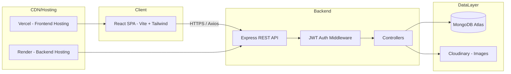
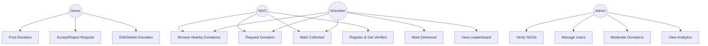
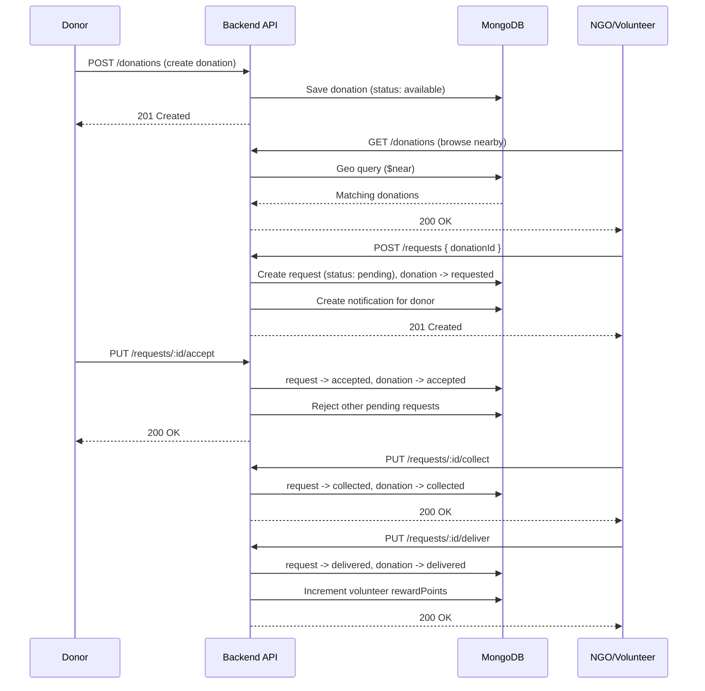
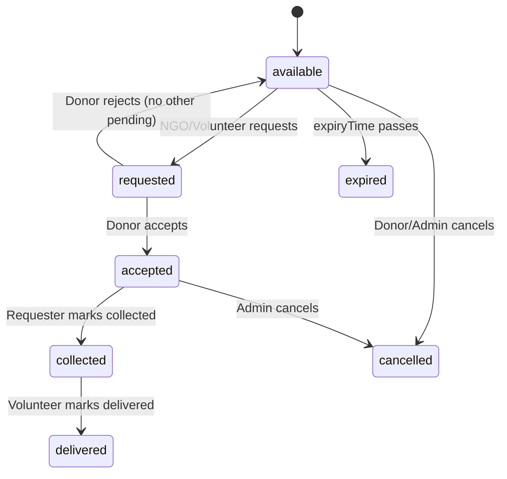

# Architecture

## System Overview

```mermaid
flowchart LR
    subgraph Client
        A[React SPA - Vite + Tailwind]
    end
    subgraph CDN/Hosting
        B[Vercel - Frontend Hosting]
        C[Render - Backend Hosting]
    end
    subgraph Backend
        D[Express REST API]
        E[JWT Auth Middleware]
        F[Controllers]
    end
    subgraph DataLayer
        G[(MongoDB Atlas)]
        H[Cloudinary - Images]
    end

    A -->|HTTPS / Axios| D
    B --> A
    C --> D
    D --> E --> F
    F --> G
    F --> H
```

## Use Case Diagram

```mermaid
flowchart TB
    Donor((Donor))
    NGO((NGO))
    Volunteer((Volunteer))
    Admin((Admin))

    Donor --> UC1[Post Donation]
    Donor --> UC2[Accept/Reject Request]
    Donor --> UC3[Edit/Delete Donation]

    NGO --> UC4[Browse Nearby Donations]
    NGO --> UC5[Request Donation]
    NGO --> UC6[Mark Collected]
    NGO --> UC7[Register & Get Verified]

    Volunteer --> UC4
    Volunteer --> UC5
    Volunteer --> UC6
    Volunteer --> UC8[Mark Delivered]
    Volunteer --> UC9[View Leaderboard]

    Admin --> UC10[Verify NGOs]
    Admin --> UC11[Manage Users]
    Admin --> UC12[Moderate Donations]
    Admin --> UC13[View Analytics]
```

## Sequence Diagram — Donation Lifecycle

```mermaid
sequenceDiagram
    participant D as Donor
    participant API as Backend API
    participant DB as MongoDB
    participant N as NGO/Volunteer

    D->>API: POST /donations (create donation)
    API->>DB: Save donation (status: available)
    API-->>D: 201 Created

    N->>API: GET /donations (browse nearby)
    API->>DB: Geo query ($near)
    DB-->>API: Matching donations
    API-->>N: 200 OK

    N->>API: POST /requests { donationId }
    API->>DB: Create request (status: pending), donation -> requested
    API->>DB: Create notification for donor
    API-->>N: 201 Created

    D->>API: PUT /requests/:id/accept
    API->>DB: request -> accepted, donation -> accepted
    API->>DB: Reject other pending requests
    API-->>D: 200 OK

    N->>API: PUT /requests/:id/collect
    API->>DB: request -> collected, donation -> collected
    API-->>N: 200 OK

    N->>API: PUT /requests/:id/deliver
    API->>DB: request -> delivered, donation -> delivered
    API->>DB: Increment volunteer rewardPoints
    API-->>N: 200 OK
```

## Request/Donation Status State Machine

```mermaid
stateDiagram-v2
    [*] --> available
    available --> requested: NGO/Volunteer requests
    requested --> accepted: Donor accepts
    requested --> available: Donor rejects (no other pending)
    accepted --> collected: Requester marks collected
    collected --> delivered: Volunteer marks delivered
    available --> expired: expiryTime passes
    available --> cancelled: Donor/Admin cancels
    accepted --> cancelled: Admin cancels
```
