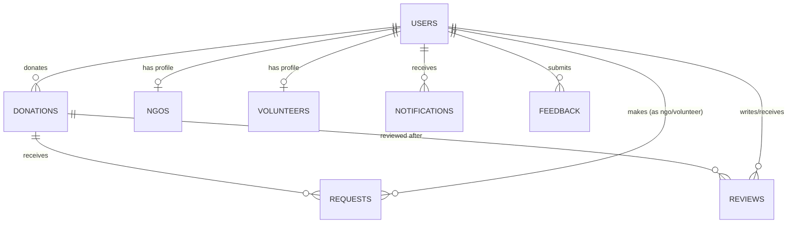

# Database Documentation

MongoDB Atlas, accessed via Mongoose. Database name: `foodshareplus`.

## Collections

### `users`
Central account collection for all roles (`admin`, `donor`, `volunteer`, `ngo`).
- Unique index on `email`
- `2dsphere` index on `location` (geospatial queries)
- Index on `role`, `city`
- Sensitive fields (`password`, tokens) use `select: false` so they're excluded by default

### `donations`
One document per food listing.
- `donor` → ref `users`
- `acceptedBy` → ref `users` (the NGO/volunteer who accepted it)
- `2dsphere` index on `location`
- Compound index on `status + expiryTime` (fast "available & expiring soon" queries)
- Text index on `foodName + description` for search

### `ngos`
One-to-one extension of a `users` document with `role: 'ngo'`.
- `user` → ref `users`, unique
- `verificationStatus`: `pending | verified | rejected`

### `volunteers`
One-to-one extension of a `users` document with `role: 'volunteer'`.
- `user` → ref `users`, unique
- Tracks `rewardPoints`, `completedDeliveries`, `rating`

### `requests`
Join entity between a `donation` and the `ngo`/`volunteer` requesting it.
- `donation` → ref `donations`
- `requestedBy` → ref `users`
- `donor` → ref `users` (denormalized for fast donor-side queries)
- Status lifecycle: `pending → accepted → collected → delivered` (or `rejected` / `cancelled`)

### `notifications`
In-app notification feed per user.
- `user` → ref `users`
- Optional `relatedDonation` / `relatedRequest` refs

### `reviews`
Post-delivery ratings.
- `donation` → ref `donations`
- `reviewer`, `reviewee` → ref `users`
- Unique compound index on `(donation, reviewer)` — one review per person per donation

### `feedback`
General product feedback submitted by logged-in users, triaged by admins.

### `contacts`
Public contact form submissions (no auth required to submit).

### `reports`
Admin-generated analytics snapshots for a given period.

---

## Relationships Diagram



## Sample Document — Donation

```json
{
  "_id": "665f1c2e8a1b2c3d4e5f6789",
  "donor": "665f1c2e8a1b2c3d4e5f0001",
  "foodName": "Vegetable Biryani",
  "category": "Cooked Food",
  "description": "Freshly cooked biryani from a wedding event, still warm.",
  "quantity": { "value": 40, "unit": "plates" },
  "images": [{ "url": "https://res.cloudinary.com/.../biryani.jpg", "public_id": "foodshare/donations/abc123" }],
  "cookedTime": "2026-07-16T10:00:00.000Z",
  "expiryTime": "2026-07-16T15:00:00.000Z",
  "pickupTime": { "start": "2026-07-16T10:30:00.000Z", "end": "2026-07-16T13:00:00.000Z" },
  "pickupAddress": "Bandra West, Mumbai",
  "location": { "type": "Point", "coordinates": [72.8296, 19.0596] },
  "status": "available",
  "freshnessScore": 85,
  "isDuplicateSuspected": false,
  "createdAt": "2026-07-16T09:00:00.000Z"
}
```
